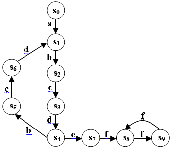
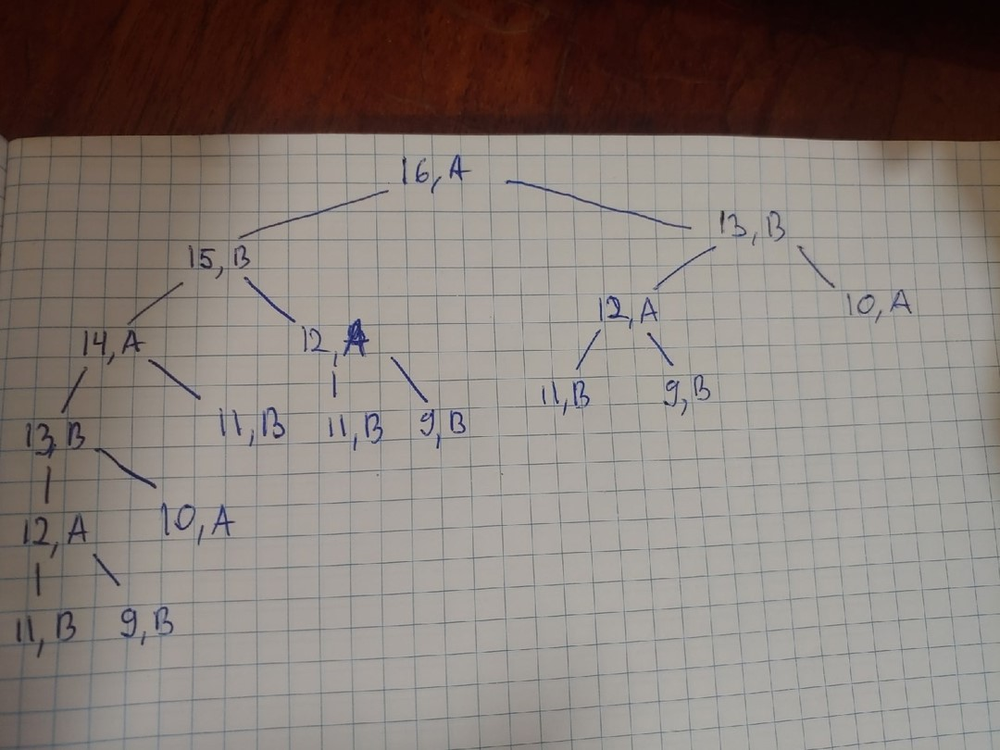
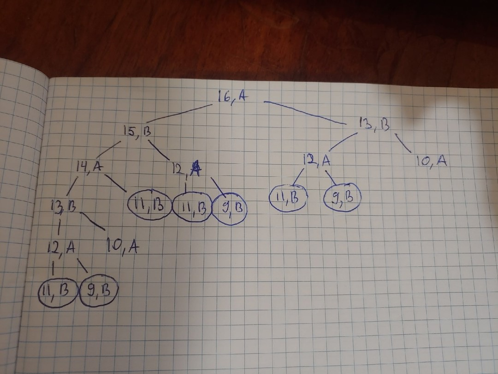
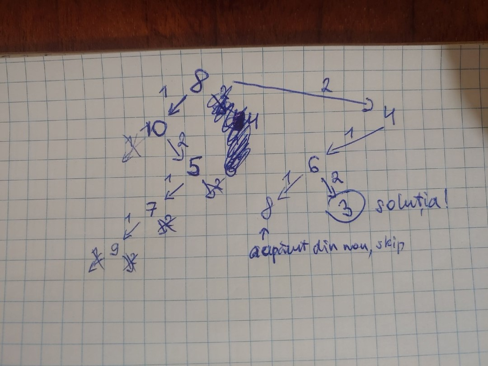

Examen la **Inteligenta artificiala**.

Student: **Curmanschii Anton**.

Grupa: **IA1901**.

Varianta: **12**.

## Nr. 1

> Fie dată secvenţa de program:

```
g(a).  
g(b).  
f(X, Y, Z) :- g(X), !, g(Y), not(X = Y), g(Z).
```

> Să se răspundă la următoare interogări non-deterministe:

1. `f(X, Y, Z).`. 

`X` este bindat la `a`. Datorita lui `!`, clauza `g(b)` nu este examinata pentru X.

In `g(Y)`, `Y` poate primi 2 valori: `a` sau `b`, insa urmatoarea clauza `not(X = Y)` verifica ca ele sa fie diferite. Deci, `Y` va avea valoarea `b`.

In `g(z)`, `Z` poate fi ori `a` ori `b`.

Deci avem 2 raspunsuri:

`X = a, Y = b, Z = a; X = a, Y = b, Z = b.`

2. `f(X, Y, b).`

Evident, `X = a, Y = b.`

3. `f(b, Y, Z)`

Aici mai interesant, deoarece `g(X)` deja nu va binda `X` la `a`. Insa `g(b)` returneaza adevarul.

`g(Y)` va fi diferit de `X`, deci `Y = a`. 

`Z` poate fi ori ambele.

`Y = a, Z = a; Y = a, Z = b.`

4. `f(X, Y, X).`

Ultima conditie in asa caz va fi mereu `True`, deci:

`X = a, Y = b.`

5. `f(X, a, Z).`

`X` este atribuit numai `a`, insa `X != Y`, deci nu are solutii.

False.

## Nr. 2
*Fie dat graful funcţiei de trecere dintr-o stare în alta pentru un automat finit.*




1. *Să se scrie forma generală a cuvintelor recunoscute de acest automat.*

Forma generala, urmarind graful: 
$ a (bcd)^{2 N + 1} e (f)^{2 M + 2} $, unde $ M, N >= 0 $

2. *Să se indice cuvântul minimal care poate fi recunoscut.*

Cuvantul minimal se va primi cand $ M $ si $ N $ sunt ambele 0.

`a bcd e ff` de lungime 7 este cel mai scurt cuvant.

3. *Să se indice un cuvânt recunoscut care are o lungime $ L: 18 < L < 23 $.*

Luam de exemplu $N = 2$ si $M = 1$ obtinem cuvantul `a bcdbcd bcdbcd bcd e ff ff` de lungime 21.


## Nr. 3

> Să se scrie un program Prolog care determină dacă într-o listă de simboluri (litere), primele patru litere ale numelui D-Voastră se conțin în aceeași ordine, de la stânga spre dreapta. Predicatul principal trebuie să aibă un singur argument – lista dată pentru verificare.

Ideea este foarte simpla: din lista prinicipala se scoate cate un element la fiecare recursie, iar din a doua lista (cu numele) se scoate un element numai atunci cand este egal cu elementul scos din lista principala.

```prolog
contains_ordered(_, []). 
contains_ordered([X|Main], [X|Sub]) :- contains_ordered(Main, Sub).
contains_ordered([X|Main], [Y|Sub]) :- X \== Y, contains_ordered(Main, [Y|Sub]).

main(X) :- contains_ordered(X, [c, u, r, m]).
```

## Nr. 4

> Considerăm următorul joc. Într-o urnă se conţin 16 bile. Doi jucători extrag pe rând bile din urnă. Fiecare jucător la mişcarea sa poate să extragă din urnă 1 sau 3 bile. Câştigă acel jucător, după extragerea căruia în urnă rămâne 11 sau mai puţine bile.
> Să se construiască arborele de joc şi să se evidenţieze o variantă de bază a jocului.  

Vom reprezenta problema prin un numar ce indica cate bile au ramas curent si un indicator al cui este randul (fie jucator A si B).

Deci, starea initiala este (16, A).

Starea finala este orice stare $(X, Y)$, unde $X <= 11$ iar Y este A ori B.
Pozitia castigatoare pentru jucatorul A este acea pozitia finala, unde Y este B, si invers.

Iata intregul arbore de joc:



Iar pa aceasta imagine am evidentiat pozitiile castigatoare pentru jucatorul A. A poate mereu castiga, luand o singura bila la primul pas.



Mai se cere o variantă de bază a jocului. 

Voi nota miscarile prin cate bile au fost selectate in paranteze [].

(16, A) --\[1\]-->  (15, B) --\[3\]--> (12, A) --\[3\]--> (9, b)

Jucatorul A castiga.

## Nr. 5

> Să se reprezinte următoarea problemă printr-un spaţiu de stări posibile: 
> „Fie dată o variabilă numerică N care poate primi valori întregi de pe segmentul \[0;10\]. 
> Iniţial N=8. Să se găsească consecutivitatea de acţiuni care va egala N cu 3. 
> Acţiunile permise: 
> a) variabila N poate fi mărită cu 2 unităţi, 
> b) dacă valoarea lui N este pară, N poate fi divizată la 2”. 
> Să se descrie stările problemei, stările iniţiale şi stările scop, regulile de trecere dintr-o stare în alta. 
> Pentru problema dată să se deseneze arborele de căutare construit de către metoda de căutare în **profunzime**. 
> Dacă într-o careva ramură al arborelui de căutare o stare al problemei se repetă, atunci această ramură nu se cercetează mai departe. 
> Construirea arborelui se opreşte la atingerea unei stări scop.

Vom nota starea la orice etapa prin un singur numar N din intervalul dat.

Starea initiala atunci este $N = 8$.

Starea scop este $N = 3$.

Actiunile (trecerile dintr-o stare in alta) permise sunt urmatoarele:
1. Daca $ N_{i} \leq 8 $, atunci $ N_{i + 1} = N_{i} + 2 $. 
2. Daca $ mod(N_{i}, 2) = 0 $, atunci $ N_{i + 1} = \frac { N_{i} } { 2 } $. 

Conditia ca starile repetate lui $ N_{i} $ deja acopera cazul cand se incearca trecerea 2 cand $ N_{i} $ deja este 0, deci nu adaugam verificarea aditionala pentru aceasta.

Vom spune ca trecerea 1 are mai mare prioritate decat trecerea 2, deci va fi executata prima.

La inceput avem doar un 8.

Executam actiunea 1, deoarece conditia se verifica.

Asa ca metoda este DFS, trecem la starea nou adaugata.

Cand $ N = 10 $, conditia 1 deja nu se verifica. Incercam actiunea 2 la starea $ N = 10 $. N este divizibila cu 2, deci primim starea $ N = 5 $.

Asa mai departe, uitati-va la imagine. Sagetile taiete indica faptul ca trecerea nu se admite deoarece nu se verifica conditia.



La o etapa am obtinut 8. Aceasta stare deja am avut-o, deci nu o dezvoltam.

Am obtinut o cale la scop. Acesta cale se reprezinta prin trecerile *2, 1, 2* si apasa starile *8, 4, 6, 3*.

Remarca: Pentru aceasta problema solutia este si optima, insa in cazul general exista mai multe cale la solutie si daca stopam algoritmul dupa atingerea scopului, in general nu primim deodata solutie optima.