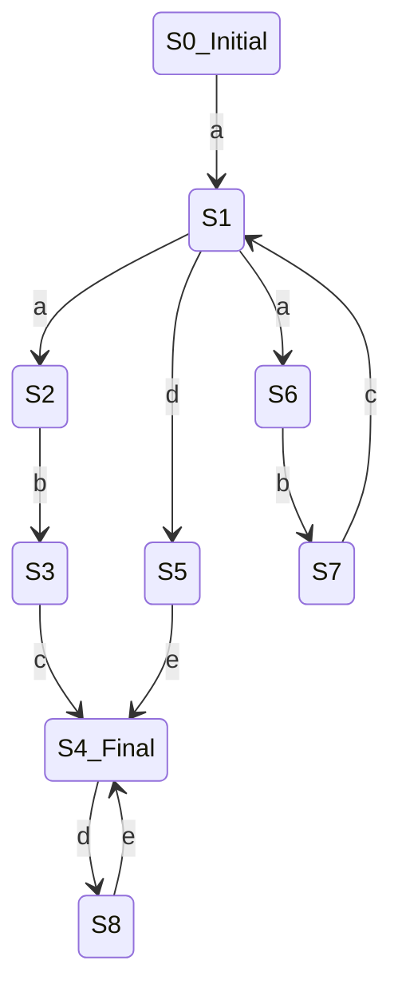

```prolog
arc(s0_Initial, s1, a).

arc(s1, s2, a).
arc(s2, s3, b).
arc(s3, s4_Final, c).

arc(s1, s5, d).
arc(s5, s4_Final, e).

arc(s1, s6, a).
arc(s6, s7, b).
arc(s7, s1, c).

arc(s4_Final, s8, d).
arc(s8, s4_Final, e).


iter(s4_Final, []).
iter(Current_State, [X|L]) :- 
    arc(Current_State, Next_State, X), iter(Next_State, L), !. 

start(L) :- iter(s0_Initial, L).
```

```
1 ?- start([a, a, b, c, d, e]).  
true.                            
                                 
2 ?- start([a, d, e]).           
true.                            
                                 
3 ?- start([a]).                 
false.                           
                                 
4 ?- start([a, a, a, b, c]).     
false.                           
```