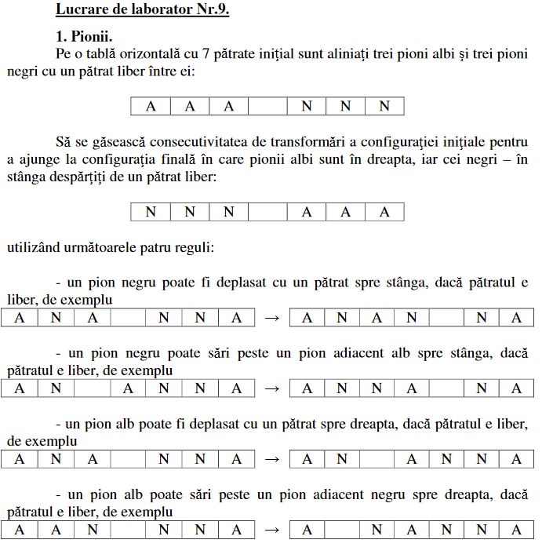

# Inteligenta Artificiala, laborator nr.9.

A elaborat: **Curmanschii Anton, IA1901**.

## Sarcina



## Soluționare

Vom reprezenta starea curentă printr-o listă. Prin recursia vom itera prin această listă, incercând să facem o mișcare la fiecare poziție. Vom repeta acest ciclu, considerând starea noua ca starea curentă. Doatorită mecanismului de reincercare în sfârșit vom trece prin toate combinațiile posibile ale tablei. Pentru terminare, vom avea o regulă de bază.

## Întregul cod

```prolog
% Zero-based utility list functions
replace_at(0, Value, [_|L], [Value|L]).
replace_at(Index, Value, [X|Rest], Result) :- 
    Index > 0, 
    Index1 is Index - 1, 
    replace_at(Index1, Value, Rest, R1),
    Result = [X|R1].

swap(Index1, Index2, List, Result) :- 
    nth0(Index1, List, Value1),
    nth0(Index2, List, Value2),
    replace_at(Index1, Value2, List, R1),
    replace_at(Index2, Value1, R1, Result).


% Generates valid actions + next states.
pawns_move(State, Action, New_State) :- 
    length(State, Length),
    Last_Index is Length - 1,
    pawns_move(Last_Index, State, Action, New_State).

pawns_move(Index, State, Action, New_State) :-
    Index >= 0,

    ((
        nth0(Index, State, Pawn),
    (
        Pawn == b -> 
        (
            % Get pawn at the adjacent position
            Index1 is Index - 1, nth0(Index1, State, Pawn1),
            (
                % If Pawn is nothing, move to that spot
                Pawn1 == n, swap(Index, Index1, State, New_State), Action = [Index, Index1];
                % If the Pawn is white
                Pawn1 == w,
                % And there is no Pawn across
                Index2 is Index1 - 1, nth0(Index2, State, Pawn2),
                Pawn2 == n,
                % Jump over the pawn
                swap(Index, Index2, State, New_State), Action = [Index, Index2]
            )
        );
        Pawn == w ->
        (
            % Get pawn at the adjacent position
            Index1 is Index + 1, nth0(Index1, State, Pawn1),
            (
                % If Pawn is nothing, move to that spot
                Pawn1 == n, swap(Index, Index1, State, New_State), Action = [Index, Index1];
                % If the Pawn is black
                Pawn1 == b,
                % And there is no Pawn across
                Index2 is Index1 + 1, nth0(Index2, State, Pawn2),
                Pawn2 == n,
                % Jump over the pawn
                swap(Index, Index2, State, New_State), Action = [Index, Index2]
            )
        )
    ));
        Index1 is Index - 1,
        % Try moving other pawns
        pawns_move(Index1, State, Action, New_State)
    ).
    

% Takes in the initial state, returns the sequence of steps to solve.
% The base case.
pawns_solve([b,b,b,n,w,w,w], []).
% Recursion.
pawns_solve(State, R) :- 
    pawns_move(State, Action, New_State), 
    pawns_solve(New_State, R1),
    R = [Action|R1].
```

## Executare

Primele mișcări arăt valide, deci funcția probabil dă rezultatul corect. Faptul că recursia se termină cu cazul de bază tot încurajează.

```
1 ?- pawns_solve([w,w,w,n,b,b,b], R).
R = [[4, 3], [2, 4], [1, 2], [3, 1], [5, 3], [6, 5], [4, 6], [2|...], [...|...]|...] ;
R = [[2, 3], [4, 2], [5, 4], [3, 5], [1, 3], [0, 1], [2, 0], [4|...], [...|...]|...] ;
false.
```